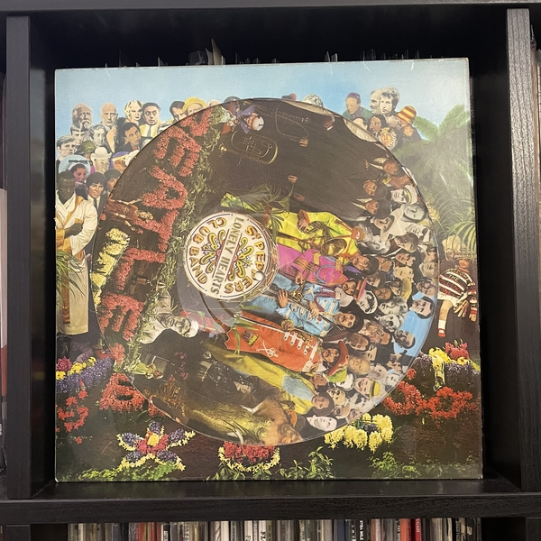
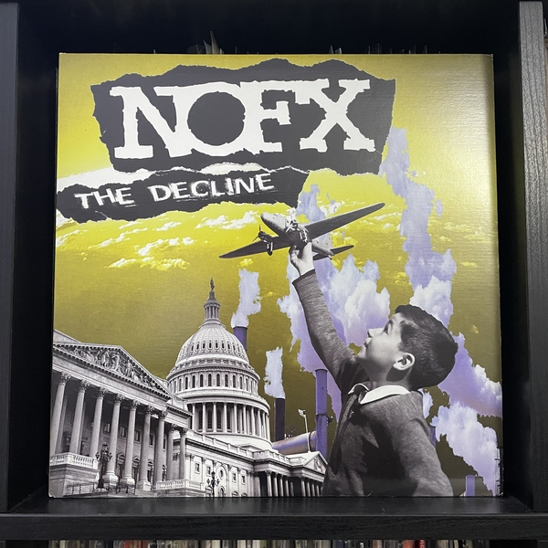
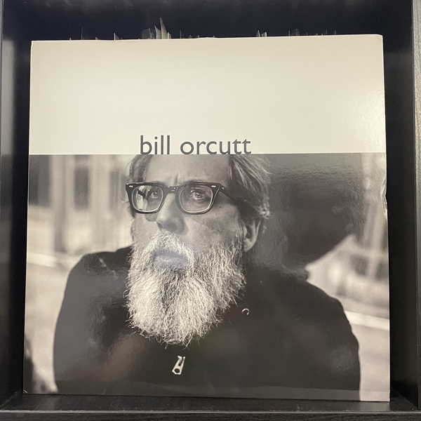
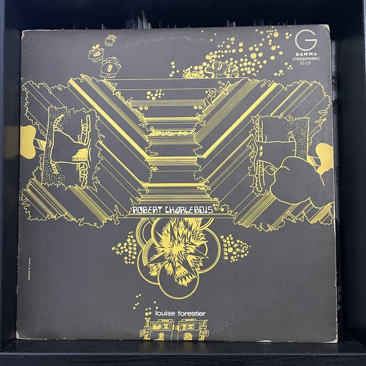
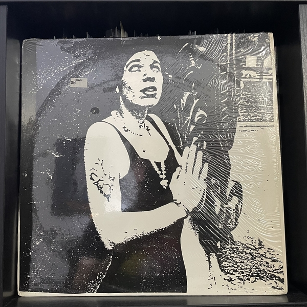
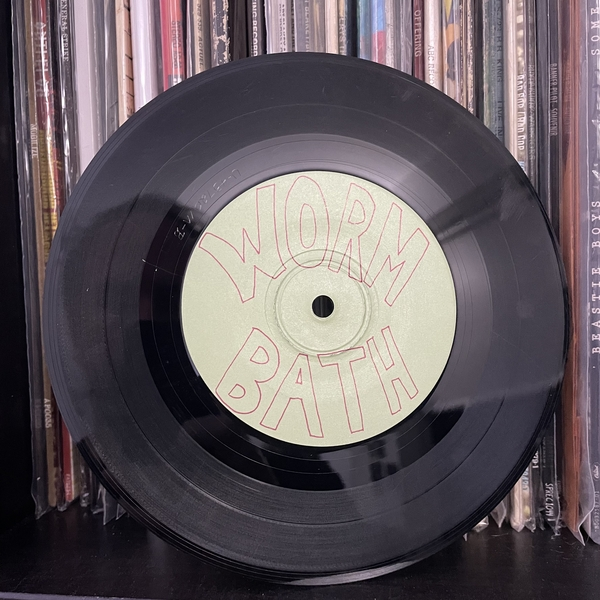
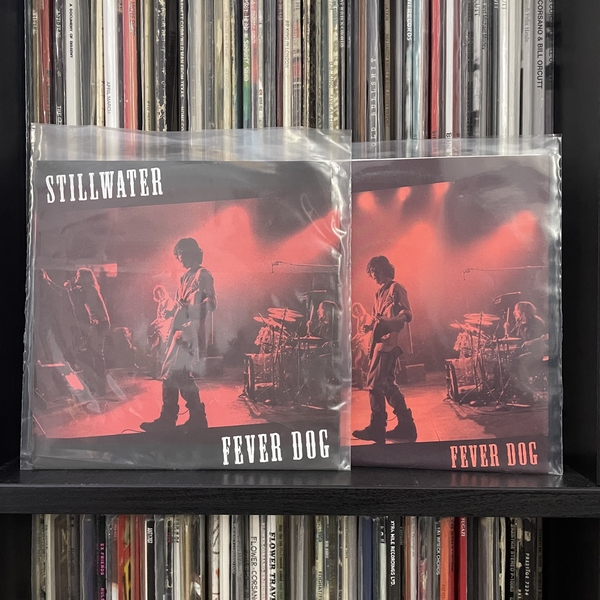
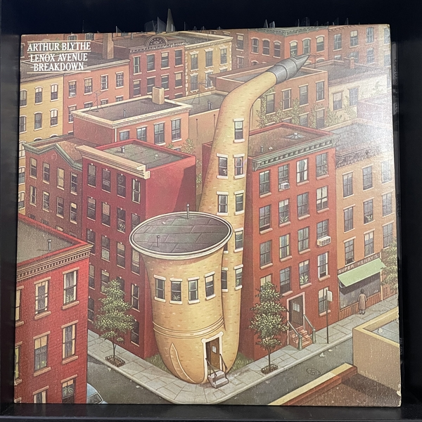

This week for me marks 10 years of collecting records. In that time, my collection has grown from 1 to 3,207 (with some reductions along the way). To celebrate the day, I put together a mix of songs from records in a few different categories. Before I get to that, here are some stats on my collection as it stands:

- Just about 30% of my collection is 7" records
- The top year of release in my collection is 2014, with 181 records being released that year
- The biggest month for adding records to my collection was November 2016, when I added 82 items.
- Punk music makes up about 42% of my collection, and Jazz about 17%

Now, on to the mix. Press play and read along

<iframe width="100%" height="60" src="https://www.mixcloud.com/widget/iframe/?hide_cover=1&mini=1&light=1&feed=%2Fresistance-frequencies%2F10-years-of-collecting-records%2F" frameborder="0" ></iframe>

## The Beatles - Sgt. Pepper's Lonely Hearts Club Band / With A Little Help From My Friends

This was the first record I owned that I still have. It was given to me as a gift. The specific edition I was given is a stereo picture disc reissue. Unfortunately, it has that awful stereo Beatles mix where all the vocals are in one channel and all the intruments in the other. The versions in this mix are from the excellent 40th anniversary remaster

## NOFX - Clams Have Feelings Too

The first record I bought was NOFX's _The Decline_. It was my first of many mailorder orders from Fat Wreck Chords (Fat Wreck makes up 11.47% of my collection). The Decline is 18 minutes long, so for this mix I opted for the B Side: this version of Clams Have Feelings Too. I prefer this one to the album version.

## Bill Orcutt - Over The Rainbow

I have a fair amount of experimental music in my collection, though it can be a hard thing to share with others. Bill Orcut is an incredible guitar player. This track is taken from his self-titled album released in 2017.

## Robert Charlebois & Louise Forestier - Egg Generation

Collecting records has totally changed the way that I travel. There is a Henry Rollins quote about how he didn't really come to understand cities he visited until he started visiting their record stores. Since my trip to Nice in June of 2012, I always make a point to do a tour of record stores wherever I go. Originally, I would print these thick packets of walking directions from Google Maps and follow them all day visiting several stores. These days, I work to figure out the best order based on location and hours, then use my phone to navigate between them.

I found this record on my first trip to Montreal in 2013.

## Leslie Q - Raga Blue

One of the best parts of digging in record stores is finding music of which I've never heard. If I find a record I like by an artist, and they don't have that many other records, I make it a point to search out their full discography. Leslie Q is one of those artists. She only put out 4 records on her own and after I picked up this _Presque Vu!_ LP, I knew I needed the rest.

## Wormbath - I Like It Better

A nice within my collection is fun punk 7"s put out by the people in the band. In many cases, these are the only record a band released, and it can be fun to pick out the bands being imitated. Wormbath here is definitely channeling some Screeching Weasel. This comes from the _Ornamental Horticulture_ 7". The particularly nice thing about these records is that they are always dirt cheap, so I can grab a big stack of them and have a fun afternoon spinning them all.

## Stillwater - Fever Dog

I'm not a big variant collector. For the most part, if I have one copy of a record I am happy. There are some exceptions obviously - if a remaster comes out that is interesting, or if there is a specific pressing of historical significance (e.g. my original Black Flag _Damaged_ with the "Anti-Parent" sticker). Sometimes though, there are versions of records with different track listings. This Stillwater (the fictional band from Almost Famous) 7" has 2 versions - one with "Hour of Need" as the B side, and one with a demo version of "Fever Dog" and "Piggyback Ride." Two other examples from my collection:

1. The Sweet's _Desolation Boulevard_, with a very different track listing between the US and UK versions
2. Snuff's _Demmamussabebonk_, with the same songs but in a different order on the US and UK versions

## Arthur Blythe - Down San Diego Way

Jazz offers nearly infinite discoverability. There are decades of increcible jazz and no matter how much I listen to, there will always be more to find. I have learned about so many great players just by picking out records that look interesting at the store, learning about labels, honing in on years and locations that fit my taste, or just trusting my gut. Such was how I found Arthur Blythe's _Lenox Avenue Breakdown_, whose opening track closes out the mix.

It's hard to know what my collection will look like in 10 more years. Tastes evolve and change, and my collection will certainly continue to represent that. If you need me, I'll probably be at the nearest record store, digging through bins.

